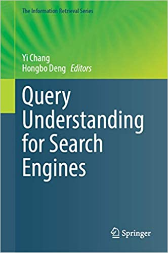
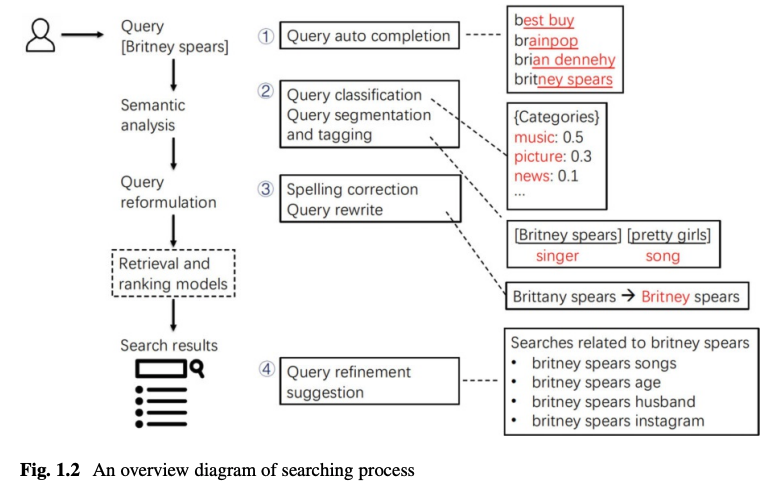
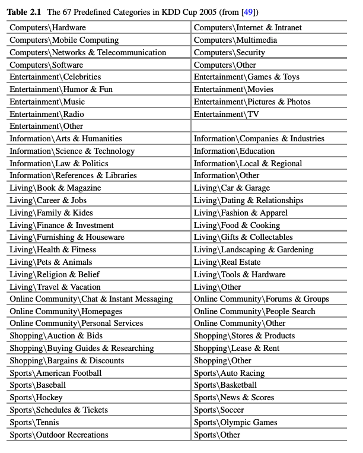

<!--  -->

# "Query Understanding for Search Engines" 

## chap.2 Query Classification

Speaker: [@hurutoriya](https://shunyaueta.com/) 
Date: 2021-10-08
[Book URL](https://www.springer.com/gp/book/9783030583330)

---

[]

---

# What is query Classification?

## Definition

> Query classification, which is to assign a search query into a given target taxonomy.

e.g. 

Query: "iPhone12"
↓
Query: "iPhone12" + Smartphone category (it is given category by your service)

## Comparision to Unlike traditional document classification tasks

-  It is much more difficult due to the 
    - Short and ambiguous nature of queries
    - Demanding online computation requirement

<!--
クエリ分類は、検索クエリを事前に与えられている分類(カテゴリ、ブランドなど)に結びつけるタスク

伝統的な文書分類タスクに比べると、クエリは短く更に曖昧なので難易度が高くなる。また、オンラインでの計算も要求されるので、システム構築の難易度が上がる。
-->

---

# Introduction

- Understanding what the user is searching for is at the heart of designing successful Web search applications

i.e., to assign a Web search query to one or more predefined categories. 

## Summarized 3 perspectives

1. Why: to understand customers’ search intent/goal—they might search to locate a particular site or to access some Web services
2. What(or Whern or Where): to understand search query’s topic, information type, geographic location, and time requirement
3. How: to understand how the search query performs—whether the results meet the curtomers’ expectations.

<!--
ユーザーの検索クエリをさまざまな方法で理解するために、さまざまな分類法が提案されていますが、それらは以下の3つの視点に集約されます。
- Why（なぜ）：ユーザの検索意図・目的を理解する。特定のサイトを探すために検索したり、あるWebサービスにアクセスするために検索したりする。
- 何を（またはいつ、どこで）：検索クエリのトピック、情報の種類、地理的な場所、および時間的要件を理解する。
- How（どのように）：検索クエリがどのように実行されたか、つまり検索結果がユーザーの期待を満たしているかどうかを理解する。
-->

---
#  Group the existing works in query classification

- Intent Classification (Sec. 2.2)
- Topic Classification (Sec. 2.3)
- Performance Classification (Sec. 2.4)

Today we will talk until Topic Classification.

---
# Query Intent Classification

> Query classification, which is to assign a search query into a given target taxonomy.

- Original paper: [A taxonomy of web search at SIGIR2002](https://dl.acm.org/doi/10.1145/792550.792552) by Broder.
- Refined Broder's paper: [Understanding user goals in web search at WWW2004](https://dl.acm.org/doi/10.1145/988672.988675)

## classification methods

- manual classification: 
    - [Automatic identification of user goals in web search]()
    - [Understanding user goals in web search at WWW2004](https://dl.acm.org/doi/10.1145/988672.988675)
- automatic ones: using Decision tree and SVM.
    - [The intention behind web queries]()
    - [Determining the informational, navigational, and transactional intent of web queries]()
    - [Query type classification for web document retrieval]()

Focus of proposing effective features for query intent identification. 

Main dataset: search courpus, query strings and user-logs.

---
# Query Topic Classification

- It is critical to understand what the user is
searching → It is usually very challenging.

why hard?: query is often highly vague, incomplete and subjective.

> If a search engine could successfully map search queries to some specific topics, the search results will be improved.

It could alleviate the ambiguity issues (e.g., jaguar the
animal versus jaguar the car), by well capturing their topics.

Query topic classification is, therefore, defined to identify the underlying topics of queries according to some pre-defined topic taxonomy.

---
# Query Topic Classification

- intermediate taxonomy for mapping (All papers at KDD2005)
    - [The ferrety algorithm for the KDD cup 2005 problem]()
    - [our winning solution to query classification in KDDCUP 2005]()
    - [Classifying search engine queries using the web as background knowledge]()
- [Robust classification of rare queries using web knowledge at SIGIR2007]()  focuse on Product saerch domain.

---
# Topic Taxonomy

- [KDD CUP-2005 Report: Facing a Great Challenge](https://www.kdd.org/exploration_files/KDDCUP2005Report_organizers.pdf)
- A formal two-level taxonomy, with 67 second level nodes and 800,000 internet user search queries

---

# Representative Work on KDD Cup Taxonomy

- [Archived web site](https://web.archive.org/web/20061012110307/http://www.acm.org:80/sigs/sigkdd/kdd2005/kddcup.html). you can download the dataset here
-  there was no straight training data. KDD Cup
2005 only provided a small set of 111 queries with labeled categories→ not sufficient data size for supuervised learning...
    - participants can use other search engine, OSS to labeling the data. But...
    - Not explicit information about pre-defined topic-category.
    - Actuall dataset is noisy(miss spell) 
    - Mannually categorize is impossible

Therefor need to design a scalable automatic classificaiton strategy.

--- 

# [KDD CUP-2005 report: facing a great challenge]()

- Preprocessing
    - Clean up noisy queries: stop words filltering, stemming and term frequency filtering
    - Advanced approach: spelling correction, compound word breaking, abbreviation expansion and named entity detection
- Gathering extra infomation
    - Motivation→ query is very short and hard to map the feature space or can not infer the meaning of query.
    - Another approach: augment queries. e.g. some participants used search result snippets, titles, and web pages to construct knowledge base, to expand query terms.

--- 

# [KDD CUP-2005 report: facing a great challenge]()

- Modeling: using SVM, KNN,Naive Baysian, LR and NN.
    1. directly mapped pre-defined directory structure to the target taxonomy, and produced required topics for each query.
    2. proposed to construct the mappings between the target topic categories and words or descriptions, so that some bag-of-words modeling strategies could be used to produce the categories of search queries.

---
# [Q2c@ust: our winning solution to query classification in KDDCUP 2005](https://dl.acm.org/doi/10.1145/1117454.1117467)

- Phase I, they tackled the data sparsity problem by developing two kinds of base classifiers, a synonym-based classifier and a statistical classifier. Specifically, the synonym-based classifier was built by keyword matching between the enriched categories from search engine.
- tackle the feature sparsity problem, they used the search engine retrieved results to help represent a query, including the snippets, titles, URLs terms, and the category names in the directory.

---
# [Q2c@ust: our winning solution to query classification in KDDCUP 2005](https://dl.acm.org/doi/10.1145/1117454.1117467)

- Phase II consisted of two stages. The first stage tackled the problem of lacking detailed query descriptions. Their strategy was to enrich queries by collecting their related web pages and category information through the use of multiple search engines, including Google and other search enginers.
- In the second stage, the enriched queries were then classified through the trained base classifiers trained